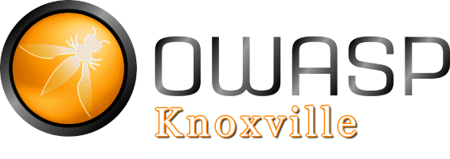
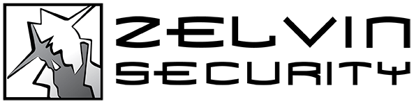

---

layout: col-sidebar
title: OWASP Knoxville 
tags: knoxville
region: North America
country: United States 
meetup-group: OWASP-knoxville

---

## Welcome to Knoxville's Local OWASP Chapter
Join the local community of application security enthusiasts today. Every quarter, we come together in-person to discuss application security. Best of all, these events are completely free! Whether you're a seasoned professional or just starting out, everyone is welcome. Don't miss out on the chance to broaden your expertise and forge valuable connections within our tight-knit local network.

## Next Event
---------------------
*Scheduled events coming soon!*

## Call For Speakers
Want to present? Contact [Chandler Johnson](mailto:chandler.johnson@owasp.org) to coordinate. This is a community-driven organization and we strongly belive that everyone has something to contribute.

## Sponsors
The OWASP Knoxville Chapter is proudly sponsored by:

## Participation
The Open Worldwide Application Security Project (OWASP) is a nonprofit foundation that works to improve the security of software. All of our projects, tools, documents, forums, and chapters are free and open to anyone interested in improving application security. 

Chapters are led by local leaders in accordance with the [Chapters Policy](/www-policy/operational/chapters). Financial contributions should only be made online using the authorized online donation button. 

Everyone is welcome and encouraged to participate in our [Projects](/projects/), [Local Chapters](/chapters/), [Events](/events/), [Online Groups](https://groups.google.com/a/owasp.com/), and [Community Slack Channel](https://owasp.slack.com/). We especially encourage diversity in all our initiatives. OWASP is a fantastic place to learn about application security, to network, and even to build your reputation as an expert. We also encourage you to be [become a member](/membership/) or consider a [donation](/donate/) to support our ongoing work.

